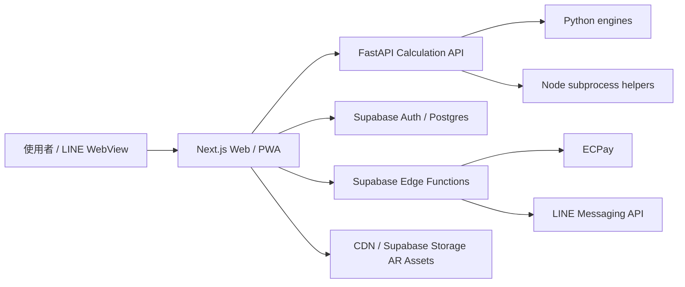

# MELE 架構文件

最後更新：2026-04-30

## 1. 產品定位

MELE 是命理媒介中心，不只是命盤工具集合。產品核心路徑是：

1. 使用者用手機或網頁進入。
2. 透過八字、紫微、占星、人類圖、馬雅、生命靈數、塔羅、盧恩取得初步解讀。
3. 結果頁提供白話摘要、個人化重點、AR 呈現與下一步建議。
4. 使用者若需要更深層解讀，可預約通過審核的老師。
5. LINE 每日儀式與每日推播建立回訪習慣。

## 2. 現行技術架構

| 層級 | 現行技術 | 說明 |
|---|---|---|
| 前端 | Next.js 14 App Router / TypeScript / Tailwind | Web、手機版、PWA、工具頁、會員頁、後台 |
| 命理計算 API | Python FastAPI | 統一提供 `/api/v1/calc/*` 計算端點 |
| 重型計算 helper | Node subprocess | `sweph`、`iztro` 等套件由 Python API 呼叫 Node helper |
| 資料庫與認證 | Supabase Postgres / Auth / RLS | 會員、老師、預約、評價、每日紀錄、LINE 綁定 |
| Edge Functions | Supabase Edge Functions | ECPay checkout/webhook、LINE Daily Push |
| 檔案與素材 | Supabase Storage 或 CDN | 老師文件、AR GLB、卡面、石面、盤面素材 |
| 本機驗證 | Node scripts + Python pytest | 結構檢查、API smoke、SQL 檢查、計算驗證 |

後端細部設計、Auth 資料流、資料庫模組、Edge Function 責任與分階段落地，請以 [Backend Blueprint](BACKEND_BLUEPRINT.md) 為準。註冊驗證信與忘記密碼信的排查流程，請看 [Supabase Auth Email Runbook](SUPABASE_AUTH_EMAIL_RUNBOOK.md)。

## 3. 部署原則

不要把整個產品假設成「只要 Vercel + Supabase 就能上線」。

- Next.js 前端可以部署在 Vercel 或同等級 Node hosting。
- Python FastAPI 必須部署在可長時間執行 Python、Node subprocess、Swiss Ephemeris 的環境，例如 Railway、Render、Fly.io、VM 或容器服務。
- Supabase Edge Functions 適合 webhook 與推播，不適合承擔全部重型排盤邏輯。
- AR / 圖像 / GLB 素材應走 CDN 或 Supabase Storage，避免讓 Next.js server 承擔大型靜態資產壓力。

## 4. 目錄結構

```text
mele/
├── apps/web/                     # Next.js 前端
│   ├── app/                      # App Router routes
│   ├── components/               # 共用 React 元件
│   ├── lib/                      # API 與 Supabase client
│   └── public/ar/                # 本機 AR 模型與靜態素材
├── python_api/                   # FastAPI 計算服務
│   ├── engines/                  # 各工具演算法與解釋
│   ├── renderers/                # SVG / HTML / speech renderers
│   ├── data/                     # 塔羅、盧恩等資料
│   └── tests/                    # Python 測試
├── supabase/
│   ├── migrations/               # Postgres schema / RLS / workflow functions
│   └── functions/                # ECPay、LINE 等 Edge Functions
├── tests/                        # Node 驗證腳本
├── docs/                         # 產品、上線、合規、驗證與營運文件
└── scripts/                      # 本機啟動腳本
```

## 5. 資料流



## 6. 計算正確性原則

確定性工具：

- 生命靈數、馬雅、八字、紫微、占星、人類圖。
- 同一輸入應得到同一輸出。
- 每個工具需要固定案例、第三方交叉比對與回歸測試。

隨機性工具：

- 塔羅、盧恩。
- 需要驗證牌庫/符文庫完整、抽取不重複、seed 可重現、正逆位與文本對應。

灰色地帶必須明示：

- Human Design 閘門與錨點採用 commonly cited 系統，非所有流派唯一標準。
- Maya Guide / Oracle 公式若有樣本不足，必須列入驗證登錄。
- 八字真太陽時若未納入均時差，需在產品與驗證文件中說明。
- 塔羅/盧恩文本與 AR 素材需保留原創或授權紀錄。

## 7. 商業模式原則

目前建議平台抽成預設為 20%，正式比例以老師合約與後台設定為準。

原因：

- 金流手續費、主機、資料庫、客服、退款、刷退、素材授權與監控都會產生成本。
- 10% 抽成容易低估營運成本，不適合作為正式商業預設。
- 若未來改成老師月費、客戶手續費或混合制，需重新更新服務條款與金流流程。

## 8. 老師審核流程

標準狀態：

1. `pending`：申請送出。
2. `reviewing`：平台審核資料。
3. `revision`：補件。
4. `interview`：試講或面談。
5. `contracted`：合約與抽成確認。
6. `active`：正式上架。
7. `paused`：暫停接案。
8. `suspended`：違規或風險停權。
9. `rejected`：拒絕申請。

公開收費前必須補齊：

- 老師未出席處理。
- 客訴與申訴流程。
- 撥款 hold 期間。
- 刷退與爭議款責任歸屬。
- 證件與 KYC 文件儲存權限。
