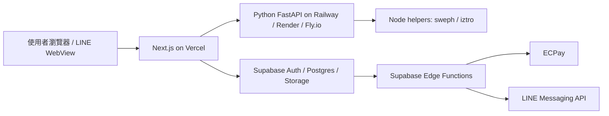

# MELE 上線風險登錄表

日期：2026-04-30

這份文件用投資人、律師與技術主管審查角度整理，不把「工程能跑」誤認成「可以公開收費」。

相關 SOP：

- [法務與個資 SOP](LEGAL_COMPLIANCE_SOP.md)
- [付款、退款與申訴 SOP](PAYMENT_REFUND_DISPUTE_SOP.md)
- [部署 Runbook](DEPLOYMENT_RUNBOOK.md)
- [素材與授權登錄表](ASSET_LICENSE_REGISTER.md)
- [演算法驗證登錄表](ALGORITHM_VALIDATION_REGISTER.md)
- [監控與 QA 計畫](OBSERVABILITY_AND_QA.md)

## 目前結論

目前狀態適合封閉內測與小規模公測，不建議直接公開收費上線。公開收費前必須完成三件事：

1. 法務條款由律師審閱。
2. 正式部署架構驗證，尤其 Python API 不能假設放在 Vercel Serverless。
3. 金流、退款、申訴、老師未出席、刷退處理流程完整演練。

## P0：公開收費前必修

| 風險 | 狀態 | 處理方式 |
|---|---|---|
| 隱私權政策與服務條款過薄 | 已補產品草案 | 已重寫 `/legal/privacy`、`/legal/tos`，但仍需律師審閱 |
| 缺免責聲明 | 已補 | 新增 `/legal/disclaimer`，說明非醫療、法律、投資或心理治療建議 |
| 未成年防護不足 | 已補第一層 | 註冊頁新增年齡/監護人同意確認；正式版仍需家長同意流程政策 |
| 忘記密碼流程 | 已補 | 登入頁新增 Supabase `resetPasswordForEmail` |
| 平台抽成 10% 過低 | 已調預設 | DB 預設與審核預設改為 20%，正式比例仍以合約為準 |
| Vercel Serverless 不適合 Python subprocess | 待部署決策 | Python API 建議部署 Railway / Render / Fly.io / VM，前端才放 Vercel |
| ECPay 金流與 webhook 未實測 | 待人工驗證 | 需使用綠界 sandbox 跑一筆完整付款、回跳、webhook、退款/申訴流程 |
| Supabase migrations 未在正式雲端跑過 | 待人工驗證 | 使用 Supabase CLI 或 Dashboard SQL Editor 套用並截圖留存 |

## P1：公測前應補

| 風險 | 建議 |
|---|---|
| Playwright e2e 需持續擴充 | 已納入首頁、每日儀式、會員解讀庫、老師後台與工具主路徑；公測前再補預約與付款沙盒 |
| 沒有錯誤監控 | 接 Sentry，至少追蹤前端 exception 與 API error |
| 沒有 Analytics | 接 Vercel Analytics 或 Plausible，追蹤工具使用與轉換 |
| LINE WebView 未測 | 用 LINE 內建瀏覽器測 OAuth、PWA、AR fallback |
| KYC 文件清除 cron 未驗證 | 在 Supabase 排程或外部 cron 留執行紀錄 |
| 老師證件儲存加密/權限 | Storage bucket 必須 private，簽名 URL 有效期要短 |
| 刷退與申訴流程不足 | 建立客服 SLA、交易 hold、爭議標記、退款紀錄 |

## P2：成長前應補

| 風險 | 建議 |
|---|---|
| 命理文本同質性 | 建立每個工具的分層文本：白話摘要、優勢、卡點、關係、工作、今日行動 |
| 塔羅/盧恩文本來源與授權 | 標註原創來源；若 AI 輔助生成，需命理師審稿 |
| AR 模型商用授權 | 每個 GLB / texture / 卡面素材建立授權清單 |
| 留存不足 | 每日儀式、LINE Push、7 日回顧、收藏命盤、老師推薦 |
| 反刷單不足 | 同 IP / 同裝置 / 短時間評價異常標記 |

## 建議部署架構

## 發布門檻

封閉內測：
- `npm run type-check` 通過。
- `npm test` 通過。
- `npm run build` 通過。
- 本機與測試 API 可用。

公開公測：
- Supabase migrations 實際套用。
- Python API 部署到可長時間執行 subprocess 的主機。
- LINE WebView、Android Chrome、iPhone Safari 真機測過。
- ECPay sandbox 完整付款測過。

正式收費：
- 律師審閱法務頁。
- 金流、退款、刷退、申訴、老師未出席流程有 SOP。
- Sentry / Analytics / 備份 / 權限稽核上線。
- 老師合約與抽成規則定稿。
