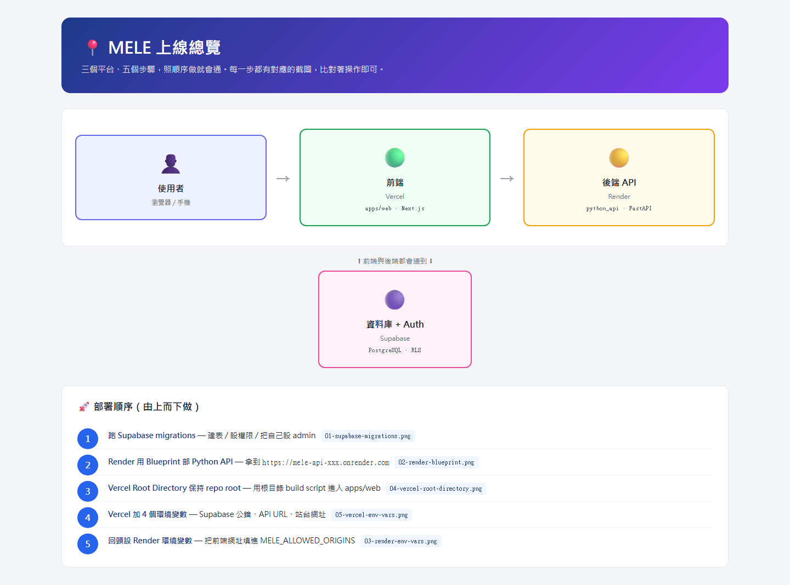
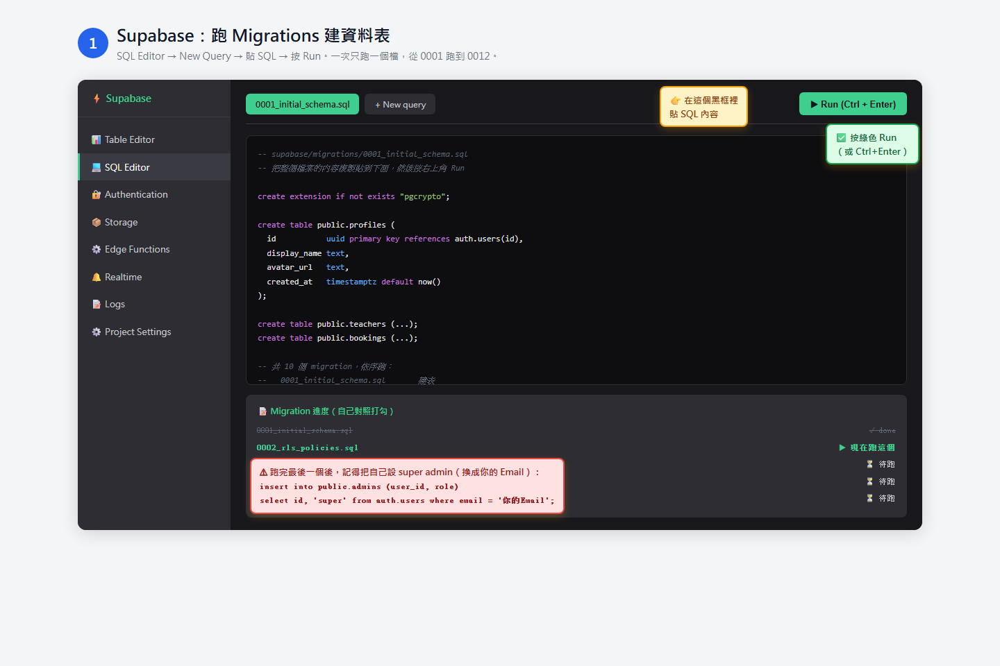
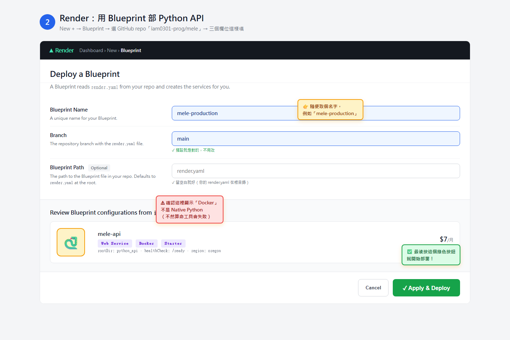
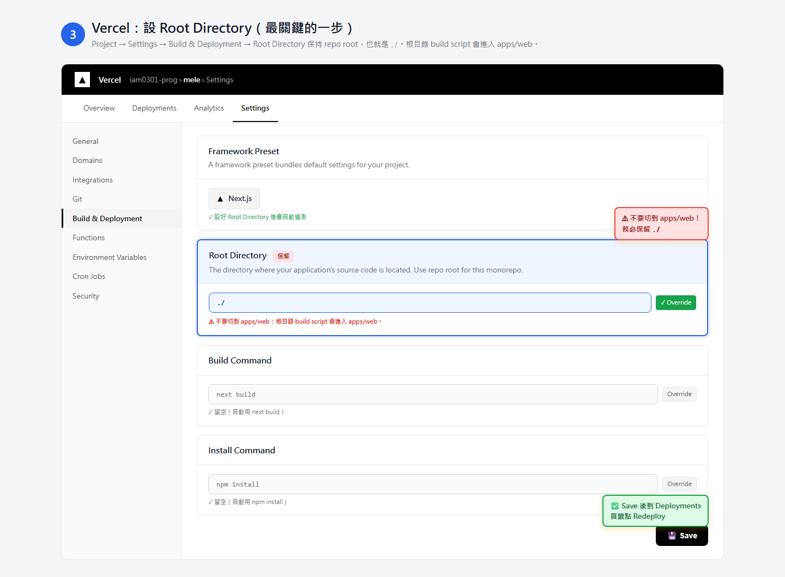
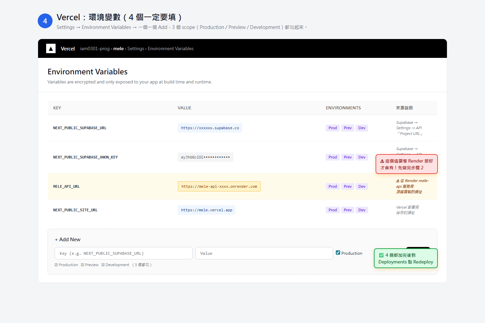
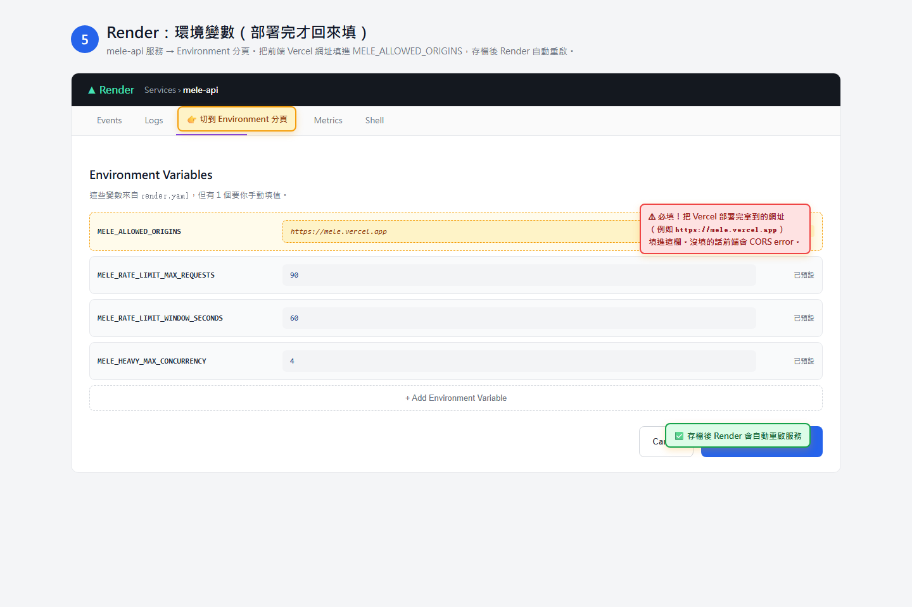

# MELE 上線視覺指引（照圖比對操作）

> 這份指引給「不熟悉 Vercel / Render / Supabase 介面」的人。
> 每張圖都標好哪一格要填什麼，照抄就行。
> 如果你比較喜歡看純文字版，請去看 `docs/DEPLOY_CHECKLIST.md`。

---

## 🎯 開始前準備（5 分鐘）

你需要這三個帳號，**全部都有免費方案**：

| 平台 | 用途 | 註冊網址 |
|---|---|---|
| Supabase | 資料庫 + 登入 | https://supabase.com |
| Render | Python API | https://render.com |
| Vercel | Next.js 前端 | https://vercel.com |

每個平台都用 **GitHub 登入** 最方便（會自動連動你的 repo）。

---

## 📍 整體地圖（先看這張）



部署順序：**Supabase → Render → Vercel → 回頭設 Render → 收尾**。
照下面的步驟一步一步做，每一步都有對應的截圖。

---

## 步驟 1：Supabase 建資料庫



### 操作步驟
1. 到 [supabase.com](https://supabase.com) → **New project** → 取個名字（例如 `mele`）
2. 等 1～2 分鐘 Project provision 好
3. 左邊欄選 **SQL Editor**
4. 點 **+ New query**
5. **依序**做以下 10 次（一次跑一個檔）：
   - 打開 `D:\mele\supabase\migrations\0001_initial_schema.sql`
   - 把整個檔案內容**全選複製**貼到 SQL Editor 的黑框
   - 按右上角 **▶ Run**（或 `Ctrl+Enter`）
   - 看到綠色 ✓ Success 後，按 **+ New query**
   - 換貼下一個檔（`0002_rls_policies.sql`）
   - 重複到 `0012_*.sql` 跑完
6. 全部跑完後，最後再多跑一個 query 把自己設成 super admin（換成你的 Email）：
   ```sql
   insert into public.admins (user_id, role)
   select id, 'super' from auth.users where email = '你的Email';
   ```

### 順便把 Supabase 兩個值記下來（之後 Vercel 要用）
左邊欄 → **Project Settings** → **API**：
- **Project URL**：`https://xxxxxx.supabase.co`
- **anon / public key**：`eyJhbGc...`（很長一串）

複製到記事本暫存。

---

## 步驟 2：Render 部署 Python API



### 操作步驟
1. 到 [Render Dashboard](https://dashboard.render.com) → 右上角 **+ New** → 選 **Blueprint**
2. 連結你的 GitHub → 選 `iam0301-prog/mele` repo
3. 三個欄位這樣填：
   | 欄位 | 填什麼 |
   |---|---|
   | **Blueprint Name** | `mele-production`（或任意你看得懂的名字） |
   | **Branch** | `main`（預設值，不用改） |
   | **Blueprint Path** | **留空**（預設讀根目錄的 `render.yaml`） |
4. 確認下方「Review」卡片顯示：
   - 服務名 `mele-api`
   - 標籤有 **Web Service**、**Docker**、**Starter** 三個 ✅
5. 按綠色 **Apply & Deploy** 按鈕
6. 等 5～10 分鐘，第一次 build 會比較慢（要裝 Python + Node 雙環境）

### 部署完成後，先記下你的 API 網址
頁面頂端會顯示 `https://mele-api-xxxx.onrender.com`，複製到記事本。

> ⚠ **這時候先別關 Render 頁面**，等下做完步驟 4 還要回來這頁設環境變數。

---

## 步驟 3：Vercel 設定 Root Directory（最關鍵）



> ⚠ 這一步是上次 build 失敗的原因。**一定要先做這個**，再做下一步。

### 操作步驟
1. 到 [Vercel Dashboard](https://vercel.com/dashboard) → 找到你的 `mele` 專案
2. 點進去 → 上方分頁切到 **Settings**
3. 左邊欄選 **Build & Deployment**
4. 找到 **Root Directory** 區塊：
   - 不要切到 `apps/web`
   - 保持 repo root，也就是 `./`
5. Build Command 用 `npm run build`；Install Command 用 `npm install`；Output Directory 留空
6. 滾到頁面底，按黑色 **Save** 按鈕

### 為什麼一定要這樣？
根目錄 `package.json` 已經把 build 轉到 `apps/web`，而 `apps/web/next.config.mjs`
也需要 repo root 做 output tracing。切到 `apps/web` 反而可能讓 monorepo trace 與路徑解析出錯。

---

## 步驟 4：Vercel 加 4 個環境變數



### 操作步驟
1. 還在 Vercel **Settings** 頁，左邊欄切到 **Environment Variables**
2. 一個一個 **+ Add New**，填這 4 個：

| Key（鍵） | Value（值從哪拿） | 三個 scope |
|---|---|---|
| `NEXT_PUBLIC_SUPABASE_URL` | 步驟 1 的「Project URL」 | ☑ 全勾 |
| `NEXT_PUBLIC_SUPABASE_ANON_KEY` | 步驟 1 的「anon public key」 | ☑ 全勾 |
| `MELE_API_URL` | 步驟 2 拿到的 `https://mele-api-xxxx.onrender.com` | ☑ 全勾 |
| `NEXT_PUBLIC_SITE_URL` | 你 Vercel 給的網址（例如 `https://mele.vercel.app`） | ☑ 全勾 |

> 每個變數加的時候，**Production / Preview / Development 三個 checkbox 都要勾**。
> 漏勾任何一個，那個環境跑起來就會壞掉。

3. 全部加完後，切到上方 **Deployments** 分頁
4. 找最近一筆 deployment（應該是 ❌ failed 那筆）
5. 點右邊 **⋯** → **Redeploy**
6. **取消勾選**「Use existing Build Cache」（讓它重新 install 一次）
7. 按 **Redeploy**，等 3～5 分鐘
8. 看到綠色 **Ready ✓** 就成功了

---

## 步驟 5：回頭設 Render 環境變數（CORS 解鎖）



> 這一步如果不做，前端會看到 **CORS error** 而連不到 API。

### 操作步驟
1. 回到 Render Dashboard → 點進 `mele-api` 服務
2. 上方分頁切到 **Environment**
3. 找到 `MELE_ALLOWED_ORIGINS` 這列
4. 把 Vercel 給你的網址貼進去（例如 `https://mele.vercel.app`）
   - 如果之後綁了自己的網域，這裡要加上去（用逗號分隔）
   - 例：`https://mele.vercel.app,https://mele.tw`
5. 按 **Save Changes**
6. Render 會自動重啟服務（約 1 分鐘）

### 其他 3 個變數都不用改
- `MELE_RATE_LIMIT_MAX_REQUESTS = 90` ✅ 預設
- `MELE_RATE_LIMIT_WINDOW_SECONDS = 60` ✅ 預設
- `MELE_HEAVY_MAX_CONCURRENCY = 4` ✅ 預設

---

## 🧪 上線測試（5 分鐘）

打開 Vercel 給你的網址（例如 `https://mele.vercel.app`），照下面順序檢查：

| 測試項目 | 怎麼確認 |
|---|---|
| 1. 首頁開得起來 | 看到正常頁面、沒有白屏 |
| 2. 註冊 / 登入 | 到 `/account/login` 註冊一個 Email、收到驗證信、登入成功 |
| 3. 算命工具 | 開 `/tools/tarot`、`/tools/numerology`、`/tools/bazi` 都能算出結果 |
| 4. 進階工具（**最重要**） | 試 `/tools/ziwei`、`/tools/astro`、`/tools/humandesign` — 這 3 個用 Node 子程式跑，最能驗 Render Docker image 完整 |
| 5. 老師申請 | `/teachers/apply` 填表送出，回到 super admin 帳號去 `/admin/applications` 審核 |

如果有任何一步壞掉，照 `docs/DEPLOY_SMOKE_TEST.md` 的「常見問題」章節排查。

---

## ⚠ 公開宣傳前的最後一步

到 Vercel Settings → Environment Variables，把這個變數**加上去並設成 `false`**：

```
NEXT_PUBLIC_ENABLE_FREE_BOOKING_TEST_MODE = false
```

不然開著等於陌生人可以無限免費佔老師時段。

加完後重新 Redeploy 一次，這次**取消勾選 Build Cache**。

---

## 圖片來源

這份指引的所有截圖都是 mockup（不是真實 Vercel/Render/Supabase 截圖），
為的是把要填的值直接畫在圖上。實際介面顏色和位置可能略有差異，
但**欄位名稱和操作流程一致**。

如果未來 Vercel/Render 改版導致對不上，可以重新編輯 `docs/deploy-guide/src/*.html` 重產 PNG。

## 重新產生 PNG 圖片

```bash
cd D:\mele\apps\web
# 把下面這個放到 apps/web/.tmp-render-deploy-guide.mjs 跑：
#   import { chromium } from "@playwright/test";
#   ... (見 git history)
```
